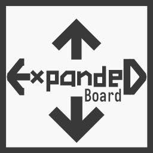
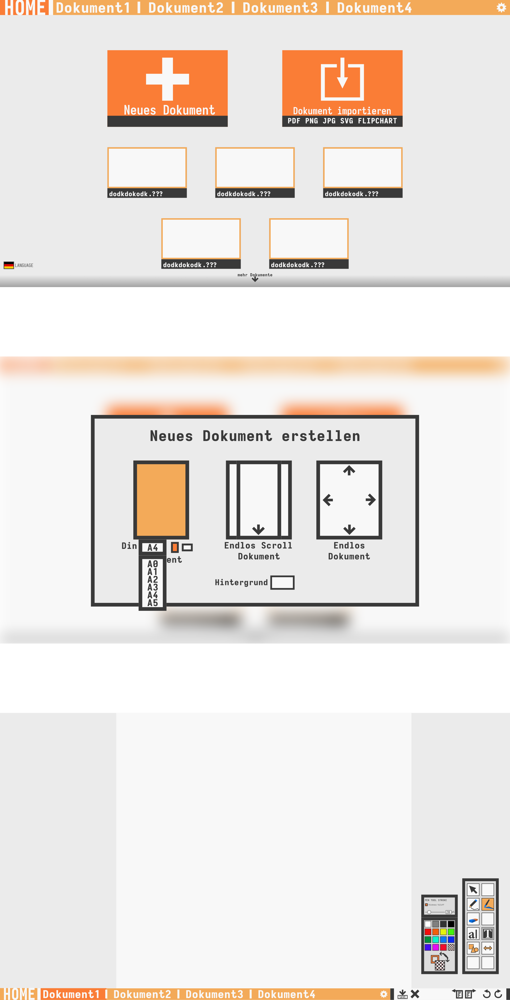

## *Computer Science Advanced Class Year 12 Project*

# **Expanded-Board**

### ***What is this App?***
Its a **Drawing Application** in your [*Browser*](janeuster.github.io/q3-project) or on [*Desktop*](github.com/janeuster/q3-project/releases). It tries keep the **UI** *understandable* and *easy* while **not** being *simple* or *rudimentary*.
<br/>
The application is mostly **vector-based** with the exception of images inserted into documents. Therefore all elements within a document are their own **objects** and *changable*.
<br/>
*Documents are called* **Artboards**. There are three different **Types of Artboards**: *Regular* -- e.g. A4; *Infinite-Scroll*; *Infinite*; 
<br/>
The **Tools** this program provided include a *Move-Tool* for roaming the Artboard, a *Selection-Tool* for selecting, moving and manipulating objects, a *Pencil-Tool* for drawing vector lines, a simple *Eraser* drawing in the color of the background of the artboard, a *Shapes-Tool* allowing you to drag *Rectangles, Triangles and Circles* onto the Artboard and an *Image-Tool* for displaying images within the Artboard.
<br/>
You can **Import Images** to be *opened as Artboards* for editing and **Export** any *Artboard to an Image Format*.

### Students / Team: 
- **Jan Eusterschulte** - *Team Lead, Concept, Programming* [ Webdesign, Drawing App ]
- **Lennart Brunn** - *Programming* [ Drawing App ] 
- **Friedrich Maagk** - *Graphics*

### Logo / Favicon



## Software
  - NodeJS
  - ReactJS - using Create-React-App
  - Electron


## Want to Test or Contribute?

- ### Requirements:
	- Git
	- NodeJS

<br/>

1. #### **Clone Repo**
```bash
foo@bar:~$ git clone https://github.com/janeuster/q3-project.git
```

<br/>

2. **Install Node Package Depencencies** 

```bash
foo@bar:~$ cd q3-project
```


```bash
foo@bar:~/q3-project$ npm ci
```
3. #### **Start the Live Development Version**

<br/>

```bash
foo@bar:~/q3-project$ npm run dev
```
You will see a desktop application appear. Anytime a file within the repositories directory is changed, those changes will appear in the live development desktop application.
The app can also be accessed via the browser(localhost:PORT). BY default the port is set to 3000(**localhost:3000**).

4. #### **Build Web App**

<br/>

```bash
foo@bar:~/q3-project$ npm run build
```
5. #### **Generate Electron Desktop App Package**

<br/>

```bash
foo@bar:~/q3-project$ npm run pack-win
```
or
```bash
foo@bar:~/q3-project$ npm run pack-linux
```

<br/>
<br/>

## Concept Art



