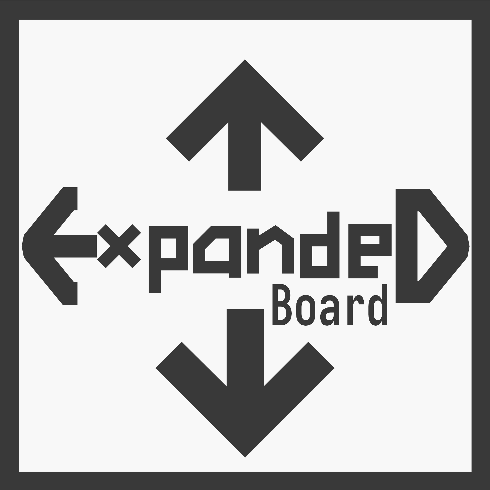
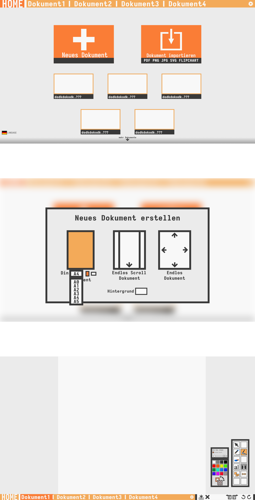

# Informatik Leistungskurs Projekt Q3

<br>

### Lehrer: Sergej Lessin

### Schüler: Lennart Brunn, Jan Eusterschulte, Friedrich Maagk

### Thema: Web basierte GUI Applikation fürs Klassenzimmer

### Name: Expanded Board

### 

### <u>Nutzung:</u> 

- Lehrer: Whiteboard Programm
- Schüler: Notizen Programm


## Planung

- **Werkzeuge (Tools)**
  - Bewegung (Move)
  - Auswahl (Select)
  - Pinsel (Brush)
  - Radierer (Shapes)
    - Rechteck
    - Dreieck
    - Ellipse
  - Bild
    - modifiziertes Rechteck mit Grafik
  - Stift (Pen)
    - erstellen eigener Formen  
- **Panels**
  - Farben
  - Werkzeuge (Tools)
- **Exportieren**
  - Formate
    - PNG
    - JPG
    - PDF
- **Speichern**
  - Eigenes Dateiformat in XML?
- **Artboard**
  - unendlich erweiterbares Zeichenbrett


- ## Sprachen / Software
    - HTML, CSS
    - Javascript / node.js
        - Libraries / node packages
            - React (Web UI)
            - electron
            - concurrently & wait-on for react-electron compatibility (wait-on listens to react-webserver to display in electron-desktop-app) [dev dependencies]

    

    ## Funktionsweise 

    - Web Applikation
        - Website für Menüs, Dateiauswahl, etc.
        - Dokumente werden als <Canvas/> Komponente implementiert und können via Javascript gesteuert werden
    - Desktop Applikation
        - **electron** ermöglicht es eine Web Applikation aus HTML, CSS und Javascript als Desktop Programm zu nutzen (Beispiele dafür sind Visual Studio Code, Discord, Atom, Microsoft Teams, Signal, Whatspp)
        - da **electron** auf chromium basiert, ist es auf jeglichen plattformen anwendbar

## Phasen

| Planung/ Lernen                                              | Implementierung                                              | Testen                                                       |
| :----------------------------------------------------------- | ------------------------------------------------------------ | ------------------------------------------------------------ |
| Lennart, Jan, Friedrich: Implementation <br />der Features erarbeiten und Aufteilung präzisieren<br />Lennart, Friedrich: Git, Javascript <br />+ Canvas Basics lernen; in Arbeit mit <br />Repository einfinden<br />*bis 31.10.21* | Aufteilung der Arbeit<br />Lennart: <br />Jan:<br />Friedrich:<br />*bis 16.01.22* | Pull Requests erstellen, bei denen jeder Änderung vorschlagen kann<br />*bis Abgabe (3. Klausur - Datum noch unbekannt)* |


## Testen / Entwickeln

- ### Vorraussetzungen:
	- git
	- nodejs

<br/>

1. #### **Clone Repo**
```bash
foo@bar:~$ git clone https://github.com/janeuster/q3-project.git
```

<br/>

2. **Install Node Package Depencencies** 

```bash
foo@bar:~$ cd q3-project
```


```bash
foo@bar:~/q3-project$ npm install
```
3. #### **Start the Live Development Version**

<br/>

```bash
foo@bar:~/q3-project$ npm run dev
```
You will see a desktop application appear. Anytime a file within the repositories directory is changed, those changes will appear in the live development desktop application.
The app can also be accessed via the browser(localhost:PORT). BY default the port is set to 3000(**localhost:3000**).


## Concept Art



