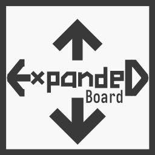

# Computer Science Advanced Class Year 12 Project

<br>

### Teacher: Sergej Lessin

### Students / Team: 
- **Jan Eusterschulte** - *Team Lead, Concept, Programming* [ Webdesign, Drawing App ]
- **Lennart Brunn** - *Programming* [ Drawing App ] 
- **Friedrich Maagk** - *Graphics*

### Topic: Web based GUI Application for classrooms

<br/>

## Project Title: **Expanded Board**




### <u>Use cases:</u> 

- Teachers: Whiteboard Application
- Students: Notetaking Application

## Planning

- **Tools**
  - Move
  - Select
  - Brush
  - Eraser
  - Shapes
    - Rectangle
    - Triangle
    - Ellipse
  - Images
  - Pen
    - create custom Shapes
- **Panels**
  - Colors
  - Tools
- **Export**
  - PNG
  - JPG
  - PDF
- **Save**
  - custom XML type file format
- **Artboard**
  - infinitely extendible drawing board


- ## Languages / Software
    - HTML, CSS
    - Javascript / Node.JS
    - Frameworks
        - Create-React-App (Web UI)
        - Electron (Desktop App)
    - Libraries / node packages
        - concurrently & wait-on for react-electron compatibility (wait-on listens to react-webserver to display in electron-desktop-app) [dev dependencies]
        - styled-components
        - xml-formatter (save files as xml)

    

    ## Functionality 

    - Web Application
      - website for menus etc.
      - Usage of HTML Canvas Element for Drawing App
    - Desktop Application
        - the Electron framwork makes it possible to run a web app as a desktop app (examples of electron apps are Visual Studio Code, Discord, Atom, Microsoft Teams, Signal Desktop, Whatspp Desktop)
        - Electron is based on chromium and therefore runs a mini version of a chrome browser and then displays the web app

## Want to Test or Develop this Application further?

- ### Requirements:
	- git
	- nodejs

<br/>

1. #### **Clone Repo**
```bash
foo@bar:~$ git clone https://github.com/janeuster/q3-project.git
```

<br/>

2. **Install Node Package Depencencies** 

```bash
foo@bar:~$ cd q3-project
```


```bash
foo@bar:~/q3-project$ npm ci
```
3. #### **Start the Live Development Version**

<br/>

```bash
foo@bar:~/q3-project$ npm run dev
```
You will see a desktop application appear. Anytime a file within the repositories directory is changed, those changes will appear in the live development desktop application.
The app can also be accessed via the browser(localhost:PORT). BY default the port is set to 3000(**localhost:3000**).

4. #### **Build Web App**

<br/>

```bash
foo@bar:~/q3-project$ npm run build
```
5. #### **Generate Electron Desktop App Package**

<br/>

```bash
foo@bar:~/q3-project$ npm run pack-win
```
or
```bash
foo@bar:~/q3-project$ npm run pack-linux
```

<br/>
<br/>

## Concept Art


